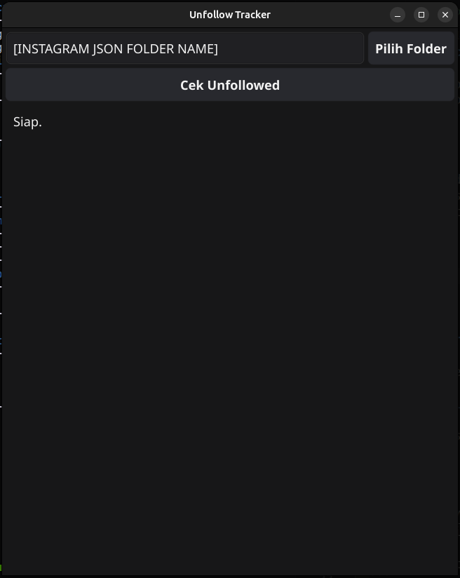
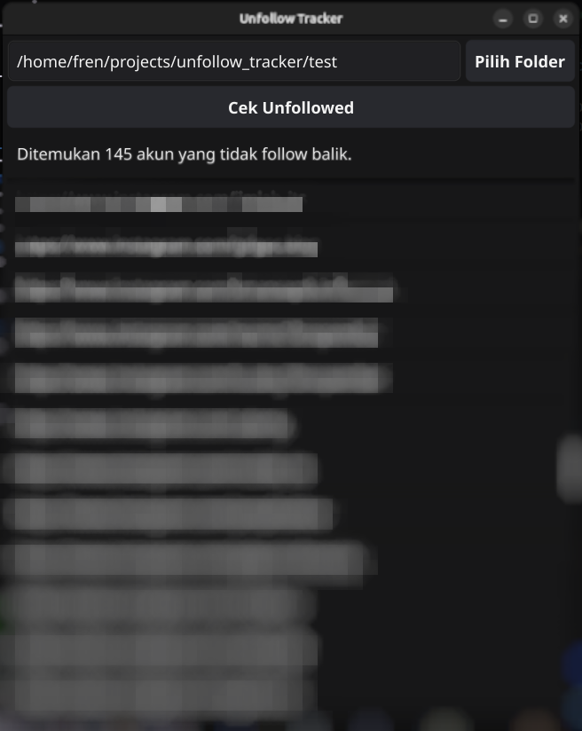

# Unfollow Tracker

Aplikasi desktop sederhana berbasis Go untuk menganalisis data export Instagram, mengetahui akun mana saja yang kamu follow tapi tidak follow balik.

## Fitur

* Membaca data export Instagram (format JSON) secara lokal. Data tidak pernah dikirim ke server mana pun.
* Menampilkan daftar akun yang di follow tapi tidak follow balik.
* Antarmuka desktop (GUI) menggunakan [Fyne](https://fyne.io/). Tidak perlu browser atau koneksi internet.
* Logging terstruktur (JSON) untuk memudahkan debugging.

## Screenshot




## Instalasi

### Unduh Binary Siap Pakai

Unduh binary sesuai sistem operasi kamu dari halaman:

* Linux: `unfollow_tracker`

Tidak perlu instalasi tambahan. Cukup jalankan file yang sudah diunduh.

### Build dari Source

Prasyarat:
* [Go](https://go.dev/) versi 1.21 atau lebih baru
* Dependensi sistem untuk Fyne (khusus Linux):
  ```bash
  sudo apt install gcc libgl1-mesa-dev xorg-dev
  ```

Langkah build:
```bash
git clone https://github.com/username/unfollow_tracker.git
cd unfollow_tracker
go mod tidy
go build -o unfollow_tracker cmd/main.go
```

## Cara Mendapatkan Data Export Instagram

1. Buka aplikasi Instagram, lalu masuk ke Pengaturan, Pusat Akun, Informasi dan izin Anda, kemudian Ekspor informasi Anda.
2. Pilih akun Instagram kamu, format JSON, dan kualitas media apa saja (media tidak dipakai aplikasi ini).
3. Pilih kategori Followers and following.
4. Tunggu email dari Instagram berisi tautan unduhan (bisa memakan waktu beberapa jam hingga beberapa hari).
5. Ekstrak file zip yang diunduh. Ini akan menghasilkan folder dengan struktur seperti berikut:

```
<nama_folder_export>/
└── connections/
    └── followers_and_following/
        ├── followers_1.json
        └── following.json
```

## Cara Pakai

1. Jalankan aplikasi (`unfollow_tracker` atau `unfollow_tracker.exe`).
2. Klik tombol Pilih Folder, arahkan ke folder hasil export Instagram (folder yang di dalamnya ada subfolder `connections/`).
3. Klik Cek Unfollowed.
4. Daftar akun yang tidak follow balik akan muncul di aplikasi.

> Catatan privasi: Semua proses berjalan sepenuhnya lokal di komputer kamu. Data export Instagram tidak pernah dikirim, diunggah, atau disimpan di luar komputer kamu.

## Struktur Project

```
.
├── cmd/
│   └── main.go                # Entry point aplikasi
├── internal/
│   ├── gui/                   # Antarmuka desktop (Fyne)
│   ├── parser/                # Membaca dan mem-parsing file JSON export Instagram
│   └── service/               # Logika bisnis (bandingkan followers vs following)
├── models/                    # Struct data (Relation, StringListData, dll)
├── pkg/
│   ├── helper/                # Utility umum (baca file, dll)
│   └── logger/                # Logger terstruktur berbasis slog
├── go.mod
└── go.sum
```

## Development

Menjalankan aplikasi langsung dari source (tanpa build binary):
```bash
go run cmd/main.go
```

Log aplikasi tersimpan di folder `logs/`, dengan nama file berdasarkan tanggal (contoh: `logs/2026-07-23.log`).

## Build untuk Windows (Compile Lintas Platform dari Linux atau Mac)

Menggunakan [`fyne-cross`](https://github.com/fyne-io/fyne-cross) (membutuhkan Docker):
```bash
go install github.com/fyne-io/fyne-cross@latest
fyne-cross windows -arch=amd64 -app-id="com.username.unfollowtracker"
```
Hasil build akan tersedia di `fyne-cross/dist/windows-amd64/`.

## Teknologi yang Digunakan

* [Go](https://go.dev/), bahasa pemrograman utama
* [Fyne](https://fyne.io/), framework GUI lintas platform
* [`log/slog`](https://pkg.go.dev/log/slog), structured logging bawaan Go

## Catatan

App yang saya buat karena tidak bisa tidur pada 23-Juli-2026. Semoga bermanfaat